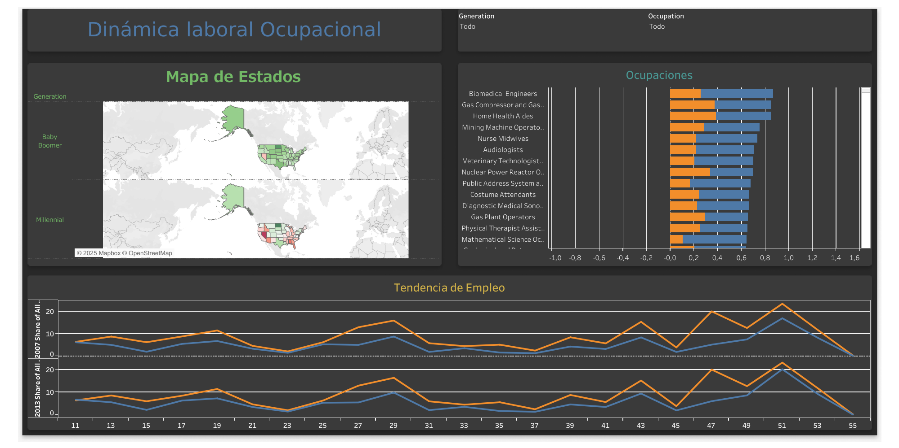

# 📊 Análisis de la dinámica laboral: Millennials vs. Baby Boomers (2007-2013)

Este proyecto de **análisis exploratorio de datos (EDA)** y **visualización** se centra en el estudio de las tendencias de empleo entre dos generaciones clave: **Millennials** y **Baby Boomers**, en el periodo de **2007 a 2013**.  

El objetivo principal es identificar y visualizar el impacto de la **crisis financiera de 2008** en la fuerza laboral de Estados Unidos, resaltando los cambios generacionales en las ocupaciones y la distribución geográfica del empleo.

---

## 🔎 Hallazgos clave

- **📉 Pérdida de empleo en sectores tradicionales**  
  Los Baby Boomers experimentaron una disminución significativa de empleos en sectores como **producción, construcción y transporte**.

- **📈 Crecimiento del sector servicios**  
  Los Millennials mostraron un notable crecimiento en roles de servicios, como la **industria alimentaria y el comercio minorista**, reflejando la transición hacia una economía de servicios.

- **🗺️ Disparidades geográficas**  
  Estados como **Dakota del Norte y Virginia** registraron crecimiento para ambas generaciones, mientras que **California y Florida** sufrieron grandes pérdidas de empleo.

- **🏥 Ocupaciones resilientes**  
  El sector de la **salud** presentó un fuerte crecimiento para ambas generaciones, destacando empleos como **Enfermeros Registrados** y **Cuidadores Personales**.

---

## 📊 Visualización del proyecto

Para comunicar los hallazgos de forma **interactiva y clara**, se construyó un **dashboard en Tableau** que incluye:

- 🗺️ **Mapa interactivo de EE. UU.** con el cambio porcentual de empleos por estado y por generación.  
- 📊 **Gráfico de barras** sobre el cambio de empleo a nivel de ocupación, identificando los sectores de mayor crecimiento y declive.  
- 📈 **Gráfico de tendencia** que muestra la participación de cada generación en el mercado laboral a lo largo del tiempo.  

---

## 🖼️ Captura de pantalla del dashboard  

---

## 🌐 Link a Tableau Public

Accede al dashboard completo en Tableau Public:  

👉 [Ver dashboard en Tableau Public](https://public.tableau.com/views/Dinmicalaboralocupacional/Dashboard1?:language=es-ES&:sid=&:redirect=auth&:display_count=n&:origin=viz_share_link)  

---

## 🚀 Conclusión

Este proyecto demuestra la capacidad de **transformar datos brutos en información valiosa**, utilizando técnicas de **visualización de datos** para contar una **historia coherente y basada en evidencia** sobre los cambios generacionales en el mercado laboral.  
